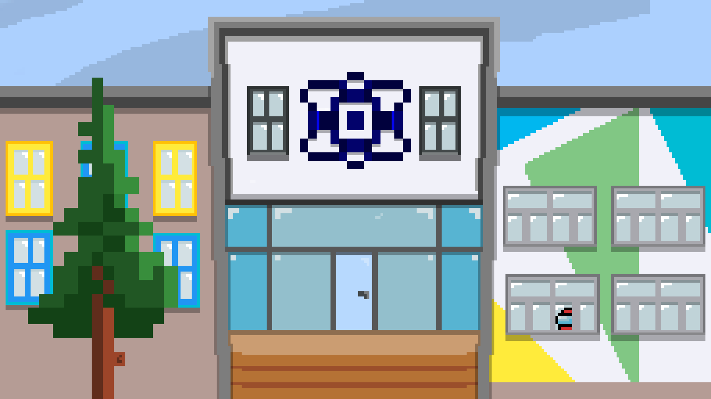

# Biology-Chemistry-Project

 
 

  
  

<h1 align="center">We are Escape the IT</h1>
<h3 align="center">And this is our project</h3>

---

## 📝 Table of Contents

+ [Preview](#preview)
+ [Contributors](#contributors)
+ [Technologies](#used-technologies)
+ [Download](#download)

---

<h1 align="center"> Preview of the game</h1> 

Our game point's to complete a serval chemistry task to escape the IT school and to complete the game

  
 

---

 

# Contributors

 
<a href = "https://github.com/aikostov20"> Aleksander Kostov</a> - Scrum Trainer 
<a href = "https://github.com/ipstoyanov20"> Ivaylo Stoqnov</a>  - BackEnd Developer 
<a href = "https://github.com/NVDespotov20"> Nikolay Despotov</a>  - BackEnd Developer 
<a href = "https://github.com/DGBratoevski20"> Denislav Bratoevski</a> - BackEnd Developer 
<a href = "https://github.com/AAMutlu20"> Andrey Mutlu</a> - Designer 
 

---

# [📄 Documentation](https://codingburgas-my.sharepoint.com/:w:/g/personal/aikostov20_codingburgas_bg/EVYUYJ-pHFtLvrKKRdHYdgMB_PBEj5-JufA-YMYlidlQFA?e=oa2ybwq) 
# [📄 Presentation](https://codingburgas-my.sharepoint.com/:p:/g/personal/aikostov20_codingburgas_bg/Ea3c1DTtPjdNi16M9Wh9hbwB2lGu7hMKC0nu-ZfNEe8-aQ)

---

 

# Used technologies 
-   Visual studio (For the code)  
-  Git Hub(For the repo) 
-   (For the design) 
-   Word (For the documentation) 
-  PowerPoint (For the presentation) 
-  Discord (For communication) 
-   Notepad(For the ReadME) 

---

# 📥Download

To download our project on your machine you just need to clone it. This can be done by pasting this text in your command prompt:

<pre>git clone https://github.com/NVDespotov20/Biology-Chemistry-Project.gitt</pre>

Or you can downoload the zip file from the repository. Go into Source folder and then click the App.sln file.

